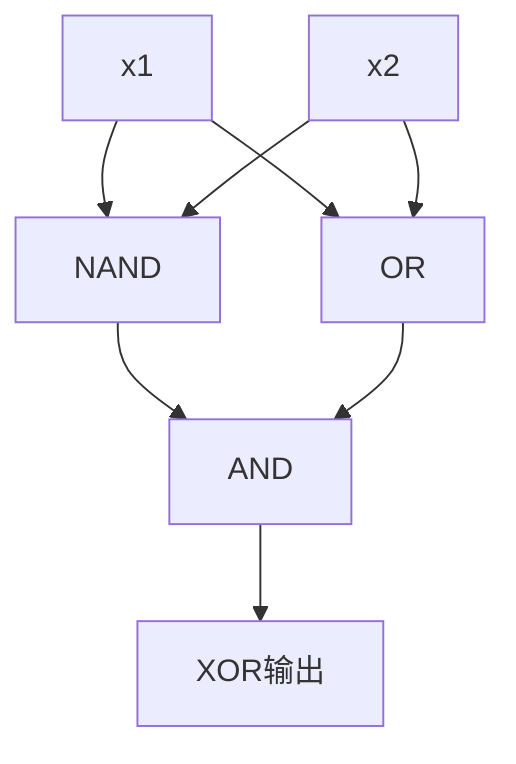

# Chapter 01: 感知器（Perceptron）

## 实现的逻辑门

| 门 | 权重 [w1, w2] | 偏置 b | 激活函数 |
|----|---------------|--------|----------|
| AND | [0.5, 0.5] | -0.7 | step |
| NAND | [-0.5, -0.5] | 0.7 | step |
| OR | [0.5, 0.5] | -0.2 | step |

## XOR 的实现（组合门）

XOR = AND(NAND(x1, x2), OR(x1, x2))

通过组合多层感知器实现了非线性问题。

## 测试结果截图

> ✅ 所有门均通过测试。

## 小结

- 感知器是一种简单的线性分类器
- XOR 无法用单层感知器实现 → 引出多层神经网络
